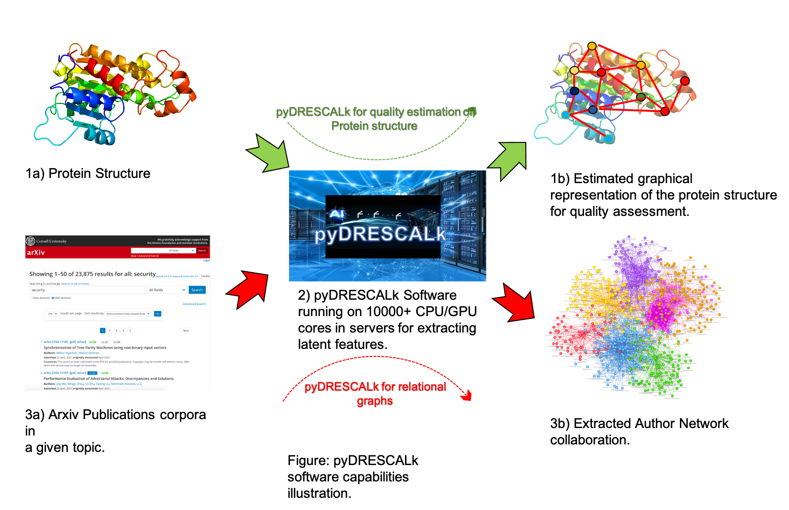
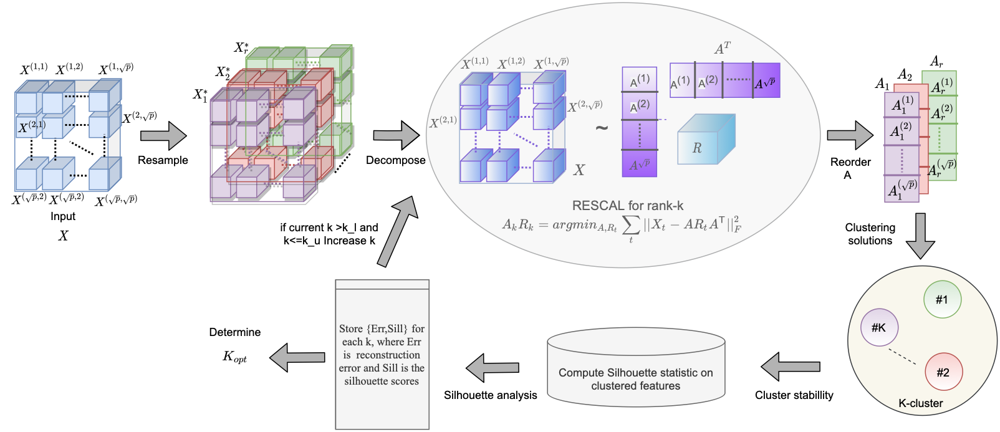
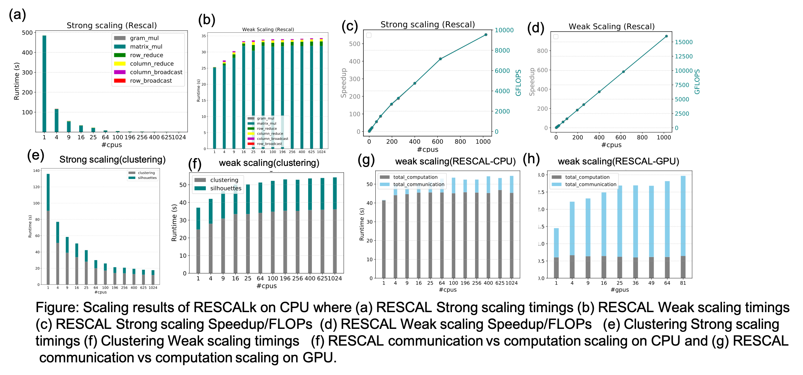
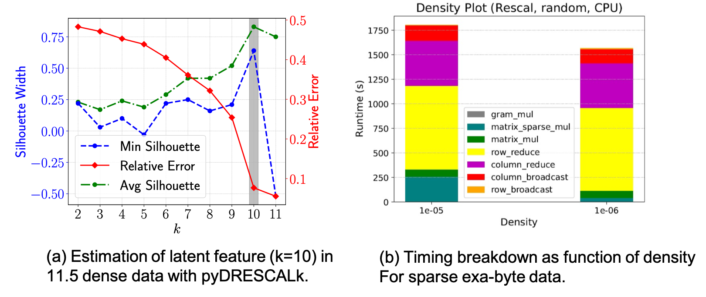

# [pyDRESCALk: Python Distributed Non Negative RESCAL with determination of hidden features](https://github.com/lanl/pyDRESCALk)


<div align="center", style="font-size: 50px">

[](https://github.com/lanl/pyDRESCALk/actions/workflows/ci_test.yml/badge.svg?branch=main) [](https://img.shields.io/badge/License-BSD%203--Clause-blue.svg) [](https://img.shields.io/badge/python-v3.7.1-blue) [](https://doi.org/10.5281/zenodo.4722448)

</div>

<p align="center">
  
</p>


<br>

[pyDRESCALk](https://github.com/lanl/pyDRESCALk) is a software package for applying non-negative RESCAL decomposition in a distributed fashion to large datasets. It can be utilized for decomposing relational datasets. It can minimize the difference between reconstructed data and the original data through Frobenius norm.  Additionally, the Custom Clustering algorithm allows for automated determination for the number of Latent features.

<div align="center", style="font-size: 50px">

### [:information_source: Documentation](https://lanl.github.io/pyDRESCALk/) &emsp; [:orange_book: Examples](examples/) &emsp; [:bar_chart: Datasets](data/) &emsp; [:page_facing_up: Paper](https://ieeexplore.ieee.org/abstract/document/9286234)

</div>

<hr/>




## Features:
* Ability to decompose relational datasets.
* Utilization of MPI4py for distributed operation.
* Distributed random initializations.
* Distributed Custom Clustering algorithm for estimating automated latent feature number (k) determination.
* Objective of minimization of Frobenius norm. 
* Support for distributed CPUs/GPUs.
* Support for Dense/Sparse data.
* Demonstrated scaling performance upto 10TB of dense and 9Exabytes of Sparse data. 



Overview of the pyDRESCALk workflow implementation.
## Installation:

On a desktop machine:
```
git clone https://github.com/lanl/pyDRESCALk.git
cd pyDRESCALk
conda create --name pyDRESCALk python=3.7.1 openmpi mpi4py
source activate pyDRESCALk
python setup.py install
```

<hr/>

On a HPC server:
```
git clone https://github.com/lanl/pyDRESCALk.git
cd pyDRESCALk
conda create --name pyDRESCALk python=3.7.1 
source activate pyDRESCALk
module load <openmpi>
pip install mpi4py
python setup.py install
```

## Prerequisites
* conda
* numpy>=1.2
* matplotlib
* MPI4py
* scipy
* h5py

## Documentation

You can find the documentation [here](https://lanl.github.io/pyDRESCALk/). 


## Usage
**[main.py](main.py) can be used to run the software on command line:**

```bash
mpirun -n <procs> python main.py [-h] [--process PROCESS] --p_r P_R --p_c P_C [--k K]
               [--fpath FPATH] [--ftype FTYPE] [--fname FNAME] [--init INIT]
               [--itr ITR] [--norm NORM] [--method METHOD] [--verbose VERBOSE]
               [--results_path RESULTS_PATH] 
               [--timing_stats TIMING_STATS] 
               [--precision PRECISION] [--perturbations PERTURBATIONS]
               [--noise_var NOISE_VAR] [--start_k START_K] [--end_k END_K]
               [--step_k STEP_K]  [--sampling SAMPLING] [--key KEY]


arguments:
  -h, --help            show this help message and exit
  --process PROCESS     pyDRESCAL/pyDRESCALk
  --p_r P_R             Now of row processors
  --p_c P_C             Now of column processors
  --k K                 feature count
  --fpath FPATH         data path to read(eg: tmp/)
  --ftype FTYPE         data type : mat/folder/h5
  --fname FNAME         File name
  --init INIT           RESCAL initializations: rand/nnsvd
  --itr ITR             RESCAL iterations, default:1000
  --norm NORM           Reconstruction Norm for NMF to optimize:FRO
  --method METHOD       RESCAL update method:MU/BCD/HALS
  --verbose VERBOSE
  --results_path RESULTS_PATH
                        Path for saving results
  --timing_stats TIMING_STATS
                        Switch to turn on/off benchmarking.
  --prune PRUNE         Prune zero row/column.
  --precision PRECISION
                        Precision of the data(float32/float64/float16).
  --perturbations PERTURBATIONS
                        perturbation for RESCALk
  --noise_var NOISE_VAR
                        Noise variance for RESCALk
  --start_k START_K     Start index of K for RESCALk
  --end_k END_K         End index of K for RESCALk
  --step_k STEP_K       step for K search
  --sampling SAMPLING   Sampling noise for NMFk i.e uniform/poisson
  --key KEY             Key for data if strored in dictionary. 
```

**Example on running  pyDRESALk using [main.py](main.py):**
```bash
mpirun -n 4 python main.py --p_r=2 --p_c=2 --process='pyDRESCALk'  --fpath='data/' --ftype='mat' --fname='dnations' --init='rand' --itr=5000 --norm='fro' --method='mu' --results_path='results/' --perturbation=20 --noise_var=0.015 --start_k=2 --end_k=5  --sampling='uniform' --data_key='R'
```

**Example estimation of k using the provided sample dataset:**
```python
'''Imports block'''

import sys
import pyDRESCALk.config as config
config.init(0)
from pyDRESCALk.pyDRESCALk import *
from pyDRESCALk.data_io import *
from pyDRESCALk.dist_comm import *
from scipy.io import loadmat
from mpi4py import MPI
comm = MPI.COMM_WORLD
args = parse()
comm = MPI.COMM_WORLD
p_r, p_c = 2, 2
comms = MPI_comm(comm, p_r, p_c)
comm1 = comms.comm
rank = comm.rank
size = comm.size
args = parse()
args.size, args.rank, args.comm, args.p_r, args.p_c = size, rank, comms, p_r, p_c
args.row_comm, args.col_comm, args.comm1 = comms.cart_1d_row(), comms.cart_1d_column(), comm1
rank = comms.rank
args.fpath = '../data/'
args.fname = 'dnations'
args.ftype = 'mat'
args.start_k = 2
args.end_k = 5
args.itr = 200
args.init = 'rand'
args.noise_var = 0.005
args.verbose = True
args.norm = 'fro'
args.method = 'mu'
args.np = np
args.precision = np.float32
args.key = 'R'
A_ij = np.moveaxis(data_read(args).read().astype(args.precision),-1,0) #Always make data of dimension mxnxn.
print('Data dimension for rank=',rank,'=',A_ij.shape)
args.results_path = '../Results/'
pyDRESCALk(A_ij, factors=None, params=args).fit()

```

**See the [examples](examples/) or [tests](tests/) for more use cases.**
<hr/>

## Benchmarking


Figure: Scaling benchmarks for 10 iterations for Frobenius norm based MU updates with MPI
operations for i) strong and ii) weak scaling and  Communication vs computation 
operations for iii) strong and iv) weak scaling. 

## Scalability


## Authors

* [Manish Bhattarai](mailto:ceodspspectrum@lanl.gov) - Los Alamos National Laboratory
* [Namita Kharat](mailto:namita@lanl.gov) - Los Alamos National Laboratory
* [Erik Skau](mailto:ewskau@lanl.gov) - Los Alamos National Laboratory
* [Duc Truong](mailto:dptruong@lanl.gov) - Los Alamos National Laboratory
* [Maksim Eren](mailto:maksim@lanl.gov) - Los Alamos National Laboratory
* [Sanjay Rajopadhye](mailto:Sanjay.Rajopadhye@ColoState.EDU) - Colorado State University
* [Hristo Djidjev](mailto:djidjev@lanl.gov) - Los Alamos National Laboratory
* [Boian Alexandrov](mailto:boian@lanl.gov) - Los Alamos National Laboratory

## How to cite pyDRESCALk?

```latex
  @misc{pyDRESCALk,
  author = {Bhattarai, Manish and Nebgen, Ben and Skau, Erik and Eren, Maksim and Chennupati, Gopinath and Vangara, Raviteja and Djidjev, Hristo and Patchett, John and Ahrens, Jim and ALexandrov, Boian},
  title = {pyDRESCALk: Python Distributed Non Negative Matrix Factorization},
  year = {2021},
  publisher = {GitHub},
  journal = {GitHub repository},
  doi = {10.5281/zenodo.4722448},
  howpublished = {\url{https://github.com/lanl/pyDRESCALk}}
}


@article{vangara2021finding,
  title={Finding the Number of Latent Topics With Semantic Non-Negative Matrix Factorization},
  author={Vangara, Raviteja and Bhattarai, Manish and Skau, Erik and Chennupati, Gopinath and Djidjev, Hristo and Tierney, Tom and Smith, James P and Stanev, Valentin G and Alexandrov, Boian S},
  journal={IEEE Access},
  volume={9},
  pages={117217--117231},
  year={2021},
  publisher={IEEE}
}


```

## Acknowledgments
Los Alamos National Lab (LANL), T-1

## Copyright Notice
>© (or copyright) 2020. Triad National Security, LLC. All rights reserved.
This program was produced under U.S. Government contract 89233218CNA000001 for Los Alamos
National Laboratory (LANL), which is operated by Triad National Security, LLC for the U.S.
Department of Energy/National Nuclear Security Administration. All rights in the program are
reserved by Triad National Security, LLC, and the U.S. Department of Energy/National Nuclear
Security Administration. The Government is granted for itself and others acting on its behalf a
nonexclusive, paid-up, irrevocable worldwide license in this material to reproduce, prepare
derivative works, distribute copies to the public, perform publicly and display publicly, and to permit
others to do so.


## License

This program is open source under the BSD-3 License.
Redistribution and use in source and binary forms, with or without
modification, are permitted provided that the following conditions are met:

1. Redistributions of source code must retain the above copyright notice, this
   list of conditions and the following disclaimer.

2. Redistributions in binary form must reproduce the above copyright notice,
   this list of conditions and the following disclaimer in the documentation
   and/or other materials provided with the distribution.

3. Neither the name of the copyright holder nor the names of its
   contributors may be used to endorse or promote products derived from
   this software without specific prior written permission.

THIS SOFTWARE IS PROVIDED BY THE COPYRIGHT HOLDERS AND CONTRIBUTORS "AS IS"
AND ANY EXPRESS OR IMPLIED WARRANTIES, INCLUDING, BUT NOT LIMITED TO, THE
IMPLIED WARRANTIES OF MERCHANTABILITY AND FITNESS FOR A PARTICULAR PURPOSE ARE
DISCLAIMED. IN NO EVENT SHALL THE COPYRIGHT HOLDER OR CONTRIBUTORS BE LIABLE
FOR ANY DIRECT, INDIRECT, INCIDENTAL, SPECIAL, EXEMPLARY, OR CONSEQUENTIAL
DAMAGES (INCLUDING, BUT NOT LIMITED TO, PROCUREMENT OF SUBSTITUTE GOODS OR
SERVICES; LOSS OF USE, DATA, OR PROFITS; OR BUSINESS INTERRUPTION) HOWEVER
CAUSED AND ON ANY THEORY OF LIABILITY, WHETHER IN CONTRACT, STRICT LIABILITY,
OR TORT (INCLUDING NEGLIGENCE OR OTHERWISE) ARISING IN ANY WAY OUT OF THE USE
OF THIS SOFTWARE, EVEN IF ADVISED OF THE POSSIBILITY OF SUCH DAMAGE.


